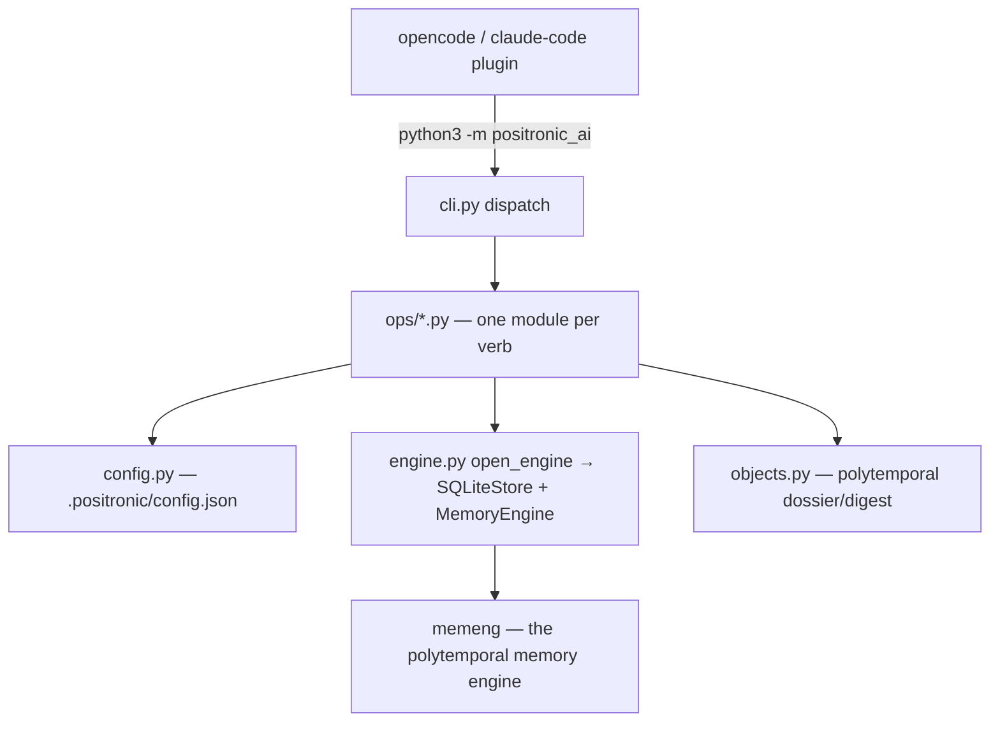

# Positronic Agent Interface — Foundation Design

> The agent interface (`positronic_ai`, PAI) is the **frontal-lobe seam**: the
> thin Python layer both plugins (opencode, claude-code) call. It owns
> `.positronic/config.json` + `.positronic/brains/{name}/memory.db`, delegates
> every memory operation to `memeng`, and presents the result to the agent.
> No MCP anywhere; the plugins never touch `memeng` directly.

## Layering

- **Plugin** = thin adapter. It spawns `python -m positronic_ai <verb>` and
  returns the JSON. All policy lives in PAI.
- **PAI** = verb layer. One module per verb, each exporting `run(...) -> dict`.
  The dict is the plugin contract: JSON-serializable, `ok`/`human` fields where
  the CLI prints a human line.
- **memeng** = the engine. PAI never re-implements memory logic; it opens a
  brain store, calls `new_event`/`activate`/`prune`/`ask`, and shapes the result.

## The polytemporal contract

The brain stores **polytemporal objects** — one canonical entity, a family of
τ-ordered sightings (messages *and* consolidations pointing at it). PAI's job
is to **preserve and present** that structure, never to flatten it:

- `recall "<cue>"` → live RRF episode hits **plus** an `object` block when the
  cue fuzzy-matches an object. The block is a **digest** (`sighting_count`,
  `tau_span`, `latest_consolidation`, `oldest_tau`) — enough to know depth
  exists without dumping the data.
- `ask "<object>"` → the **full τ-ordered dossier** — every sighting with its
  own `tau`/`wall`/`kind`. This is the dig-deeper verb.
- Choosing *which version answers the query* is the **agent's job** (the
  frontal lobe), not the engine's. PAI hands the material; the agent reasons.

## Verb pipeline (`run`)

Every verb follows the same skeleton:

1. **Resolve config** — `load_config(dir)` with defaults merged (config.py).
2. **Open the brain** — `open_engine(dir, brain)` → `(SQLiteStore, MemoryEngine)`.
   Raises `FileNotFoundError` when the db is absent; verbs that must survive
   missing brains catch narrowly (see code-quality note below).
3. **Delegate to memeng** — `e.new_event(...)`, `e.activate(...)`, `e.prune(...)`,
   or `objects.*` for the dossier.
4. **Shape the return** — a JSON-serializable dict; `human` included where a
   CLI consumer wants a rendered line.

### Federation

`recall` and `ask` scan every configured brain and **merge with reciprocal-rank
fusion** (RRF) — the same algorithm memeng uses across channels. A failing
brain is **skipped with a warning log**, never allowed to fail the whole search
(`# noqa: BLE001 (federated skip)`).

## Config (config.py)

`.positronic/config.json`, zod-equivalent validation:

- **Per-brain** keys: `profile` (balanced|archival|long_term|short_term),
  `embed` (lexical|local|remote), `threshold`.
- **Top-level** keys: `live`, `local_url`, `remote_url`, `remote_key`,
  `engram_tag`, `auto.{consolidate_every,prune_every}`,
  `counters.{since_consolidate,since_prune}`, `dedup`, `capture_user`.
- `_merge_defaults` fills missing keys; `_validate` raises on bad values.
- **PII firewall**: config verb blocks `*.db` / `memory.db` / `brain_henry`
  paths; `remote_key` is masked unless `--show-secrets`.

## Error handling discipline

- **Verb bugs fail loud**: an unexpected exception inside a verb propagates to
  `cli.main`, which prints `{verb}: {error}` to stderr and returns exit 1.
- **Health probes degrade**: doctor/bge/llama checks return `missing`/`down`
  on any failure (annotated `# noqa: BLE001 (health probe)`).
- **Federation skips**: a broken brain is logged and skipped, not fatal.
- Every broad `except Exception` carries a `# noqa: BLE001 (...)` rationale —
  never a silent swallow.

## Test ergonomics

`pyproject.toml` declares `[tool.pytest.ini_options] testpaths = ["tests"]`;
`memeng` + `positronic_ai` are editable-installed, so `pytest` runs from the
repo root with no `PYTHONPATH` hack. ruff is enforced clean (`ruff check`).

## Future

LLM rerank judge over the polytemporal dossier (recall digest → `ask` depth →
agent decides) slots in behind the `objects.py` digest — no engine change needed.